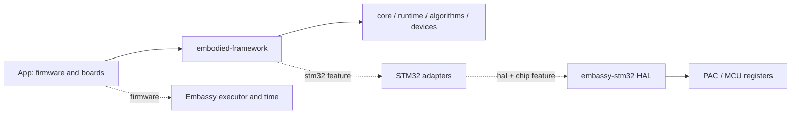

# embodied_framework

[中文](README.md) · [English](README.en.md)

Write firmware for STM32 F/G/H microcontrollers in Rust, with peripheral communication, control algorithms and device protocols. Application entry points, tasks and board configuration live in App/, so you can start with a heartbeat and then connect your own hardware.

The firmware uses `no_std`, which means it does not depend on Rust's operating-system standard library. Embassy schedules async tasks: while one task waits for a peripheral, other ready tasks can run. The STM32 HAL provides the Rust drivers that operate the peripherals.

## Quick start

Without a board, start with the [host PoC](docs/poc.md) to exercise initialization, a CAN frame queue, protocol decoding and PID control before cross-compiling the minimal firmware.

### 1. Prepare the tools

On a new machine or with a fresh source download, follow the [toolchain guide](docs/en/toolchain.md) to install Rust 1.98.1, a matching host linker and the compilation target for your MCU. The project uses Edition 2024, Rust's 2024 language rules. The source does not include the local `.tools/` directory.

If this checkout already has a local toolchain installed, open PowerShell at the repository root and run the following command. `env.ps1` makes those existing tools available in the current terminal; it does not install them:

```powershell
. .\scripts\env.ps1
```

### 2. Build the minimal firmware

Once the toolchain is available, run these commands in the repository directory containing the root `Cargo.toml`. They work in PowerShell, Git Bash and Linux Bash. Cargo is Rust's build tool. The first command checks workspace compilation; the second builds firmware for STM32H723VG:

```text
cargo check --workspace --locked
cargo build -p embodied-app --bin minimal --release --locked --target thumbv7em-none-eabihf --features stm32h723vg
```

After a successful build, the firmware is at `target/thumbv7em-none-eabihf/release/minimal`. This ELF file contains the program and debug information. `--features stm32h723vg` selects the chip configuration. For another MCU, use the application guide to find its feature and target first. Select one chip configuration per build and match the Flash bank layout to the hardware.

### 3. Flash and read the heartbeat

The [minimal App](App/src/bin/minimal.rs) uses internal clocks and needs no additional LED or serial wiring. Once flashed to the matching chip and started, it prints a heartbeat once per second through RTT. RTT carries logs through a debug probe. Follow the [programming and debugging steps](docs/en/toolchain.md#choose-a-programming-and-debugging-tool) to choose probe-rs, Ozone or OpenOCD for your probe and chip. An ELF confirms the build completed. Check the heartbeat on the board.

### Create an independent application

Run at the repository root; the parent directory must exist and the destination must not exist:

```text
cargo fetch --locked
cargo xtask new --chip stm32g474re --path ../robot-demo --name robot-app
cd ../robot-demo
cargo app-build
cargo app-check
```

This creates a separately maintained application with App, a copy of the framework sources, dependency lockfiles, editor settings and CI (automated checks). `cargo app-build` builds its firmware, and `cargo app-check` checks the generated project. The generic G474RE template uses internal clocks; the G474CE reference board has its own clock and wiring configuration.

## Capabilities and support

- Hardware initialization runs through nine stages. Ready starts tasks after all stages succeed. Periodic tasks follow scheduled times and can count missed periods.
- Tasks exchange data through fixed-capacity queues, message pools and signals, and coordinate access with async locks and semaphores. Timing includes software timers and hardware compare events.
- Peripheral interfaces cover CAN, UART, USB, SPI and PWM. Algorithms include PID, filters, matrices, state estimation and coordinate transforms.
- Device protocols cover DJI, Damiao, RobStride and LK motors, WFLY, the referee protocol and BMI088/ICM42688 sensors. Connection monitoring detects device timeouts.
- The project includes five reference-board configurations, a standalone project generator, build checks and a GitHub Actions release-draft workflow.

The available configurations cover 895 models and 921 chip/core configurations, covering F0/F1/F2/F3/F4/F7, G0/G4 and H5/H7. The 57 G411/G414, H7R/S and H543/H553 models are excluded. See the [support policy](data/support-policy.json) and [scope](docs/support-scope.md). Available backends do not imply hardware validation of every peripheral.

## Architecture and layout



Clocks, pins, DMA and interrupts are configured directly in Rust board modules. `embedded-hal` defines the common interfaces for device drivers, `embassy-stm32` implements them for STM32, and the PAC provides register access. Application behavior belongs in App. Framework crates do not depend on App.

See [architecture](docs/en/architecture.md) for the full crate dependencies, feature boundaries and startup sequence.

| Directory | Responsibility |
|---|---|
| `App/` | Entry points, user tasks and reference boards |
| `crates/` | Core, runtime, algorithms, devices and STM32 adapters |
| `xtask/ · scripts/` | Generation, builds, ELF inspection and release tools |
| `vendor/ · data/` | Pinned HAL/PAC, chip catalogue and patch sources |
| `docs/` | Chinese/English handbooks and focused guides |
| `.github/workflows/` | Daily CI, manual matrices and release drafts |

## Developer handbook

| Chapter |
|---|
| [Toolchain installation and use](docs/en/toolchain.md) |
| [Application development](docs/en/application-guide.md) |
| [Rust board configuration](docs/en/board-configuration.md) |
| [Architecture](docs/en/architecture.md) |
| [Design and implementation](docs/en/design-and-implementation.md) |
| [Best practices](docs/en/best-practices.md) |
| [CI/CD design](docs/en/ci-cd.md) |
| [Troubleshooting](docs/en/troubleshooting.md) |

## Maintenance and release

CI checks formatting, documentation, host compilation and representative firmware. Builds covering all configurations must be started manually. Pushing a `v*` tag runs CI and validates the version and artifacts before packaging H723 minimal firmware and creating a Release draft. This workflow does not flash an MCU. Consult the corresponding run records for remote Actions and hardware results.

The repository contains sources and development tools. It does not include phase-specific test projects, old firmware or historical verification archives. Builds create `target/`; local toolchains and downloaded dependencies use additional disk space. See [storage](docs/storage.md).

## License

Project code uses [MIT](LICENSE). Third-party dependencies, data and local patches retain their licenses and author attribution; see [third-party notices](THIRD_PARTY_NOTICES.md).
