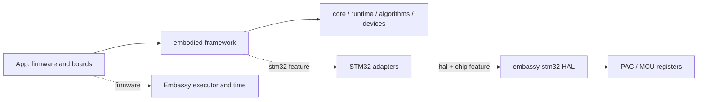

# embodied_framework

[中文](README.md) · [English](README.en.md)

用 Rust 为 STM32 F/G/H 系列编写固件，包含外设通信、控制算法和设备协议。应用入口、任务和板级配置都放在 App/ 中，便于从最小心跳开始，逐步接入自己的硬件。

固件使用 `no_std`，即不依赖操作系统提供的 Rust 标准库。Embassy 负责调度异步任务，让一个任务等待外设时，其他就绪任务继续运行；STM32 HAL 是实际操作芯片外设的 Rust 驱动。

## 快速开始

没有开发板时，也可以先运行[主机 PoC](docs/poc.md)，验证初始化、CAN 数据队列、协议解析和 PID，再交叉编译最小固件。

### 1. 准备工具

新电脑或刚下载的源码：先按[工具链手册](docs/zh-CN/toolchain.md)安装 Rust 1.98.1、匹配的主机链接器，以及 MCU 的编译目标（target）。项目使用 Edition 2024，也就是 Rust 2024 版的语言规则。源码不附带本机工具目录 `.tools/`。

如果这份仓库已经安装了局部工具链，在 PowerShell 中进入仓库根目录并执行下面的命令。`env.ps1` 只让当前终端使用这些已有工具，不会安装它们：

```powershell
. .\scripts\env.ps1
```

### 2. 编译最小固件

确认工具链可用后，在包含根 `Cargo.toml` 的仓库目录执行以下命令。它们适用于 PowerShell、Git Bash 或 Linux Bash。Cargo 是 Rust 的构建工具；第一条命令检查工作区能否编译，第二条为 STM32H723VG 生成固件：

```text
cargo check --workspace --locked
cargo build -p embodied-app --bin minimal --release --locked --target thumbv7em-none-eabihf --features stm32h723vg
```

编译成功后，固件文件位于 `target/thumbv7em-none-eabihf/release/minimal`。这是 ELF 文件，包含程序和调试信息。`--features stm32h723vg` 选择芯片配置；使用其他 MCU 时，先在 App 开发指南中查询对应 feature 和 target。一次只选一个芯片配置，Flash bank（闪存分区方式）也必须与硬件一致。

### 3. 烧录并查看心跳

[最小 App](App/src/bin/minimal.rs)使用内部时钟，不需要额外连接 LED 或串口。烧录到匹配的芯片并正常启动后，它每秒通过 RTT 输出一次心跳。RTT 通过调试探针读取日志。按[烧录和调试步骤](docs/zh-CN/toolchain.md#选择烧录和调试工具)，为自己的探针和芯片选择 probe-rs、Ozone 或 OpenOCD。生成 ELF 只说明编译完成，心跳需要在板上确认。

### 创建独立应用

在仓库根目录执行；父目录必须存在，目标目录必须尚不存在：

```text
cargo fetch --locked
cargo xtask new --chip stm32g474re --path ../robot-demo --name robot-app
cd ../robot-demo
cargo app-build
cargo app-check
```

完成后会得到可单独维护的应用工程，包含 App、框架源码副本、依赖锁文件、编辑器配置和 CI（自动检查流程）。`cargo app-build` 生成固件，`cargo app-check` 检查生成的工程。G474RE 通用模板采用内部时钟；G474CE 参考板有自己的时钟和接线配置。

## 能力与支持范围

- 按九个阶段初始化硬件，全部成功后通过 Ready 启动任务；周期任务按预定时间运行，并能记录错过的周期。
- 任务可以通过固定容量队列、消息池和信号交换数据，使用异步锁与信号量协调访问；定时功能包括软件定时器和硬件比较事件。
- 外设接口包括 CAN、UART、USB、SPI 和 PWM。算法包括 PID、滤波、矩阵运算、状态估计和坐标变换。
- 设备协议包括 DJI、达妙、RobStride、凌控电机，WFLY、裁判协议，以及 BMI088/ICM42688 传感器。连接监测用于判断设备是否超时。
- 提供五块参考板的配置、独立工程生成器、构建检查，以及 GitHub Actions 发布草稿流程。

当前可选择的配置包含 895 个型号、921 个芯片/内核配置，覆盖 F0/F1/F2/F3/F4/F7、G0/G4、H5/H7。G411/G414、H7R/S、H543/H553 共 57 个型号排除。准确名单见[支持策略](data/support-policy.json)与[范围说明](docs/support-scope.md)。支持范围表示可选择的后端配置，不等同于全部外设已实机验证。

## 架构与目录



时钟、引脚、DMA 和中断直接写在 Rust 板级模块中。`embedded-hal` 规定设备驱动通用的接口，`embassy-stm32` 提供 STM32 的具体实现，PAC 则提供寄存器访问。应用逻辑放在 App，框架不依赖 App。

完整的 crate 依赖、feature 边界和上电时序见[架构设计](docs/zh-CN/architecture.md)。

| 目录 | 职责 |
|---|---|
| `App/` | 入口、用户任务与参考板 |
| `crates/` | 核心、运行时、算法、设备与 STM32 适配 |
| `xtask/ · scripts/` | 工程生成、构建、ELF 检查与发布工具 |
| `vendor/ · data/` | 固定 HAL/PAC、芯片目录和补丁来源 |
| `docs/` | 中英文开发手册与专题说明 |
| `.github/workflows/` | 日常 CI、手动矩阵与发布草稿 |

## 开发手册

| 章节 |
|---|
| [工具链安装与使用](docs/zh-CN/toolchain.md) |
| [App 开发指南](docs/zh-CN/application-guide.md) |
| [Rust 板级配置](docs/zh-CN/board-configuration.md) |
| [架构设计](docs/zh-CN/architecture.md) |
| [设计原理与实现](docs/zh-CN/design-and-implementation.md) |
| [最佳使用示范](docs/zh-CN/best-practices.md) |
| [CI/CD 设计](docs/zh-CN/ci-cd.md) |
| [排错与常见问题](docs/zh-CN/troubleshooting.md) |

## 维护与发布

CI 自动检查格式、文档、主机编译和代表固件。覆盖全部配置的构建需要手动触发。推送 `v*` 标签后，发布流程先运行 CI 并校验版本和产物，再打包 H723 最小固件、创建 Release 草稿。该流程不烧录 MCU；远端 Actions 和实机验证的结果请查看相应执行记录。

仓库包含源码和开发工具，不附带阶段测试工程、旧固件或历史验证归档。构建会生成 `target/`，本机工具链和下载的依赖另占磁盘空间。见[存储说明](docs/storage.md)。

## 许可证

项目代码使用 [MIT](LICENSE)。第三方依赖、数据和本地补丁保留各自的许可证及原作者署名，见[第三方声明](THIRD_PARTY_NOTICES.md)。
