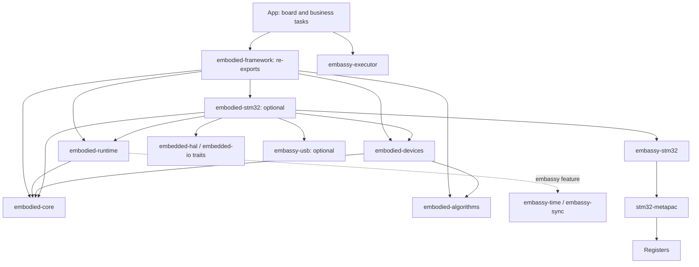
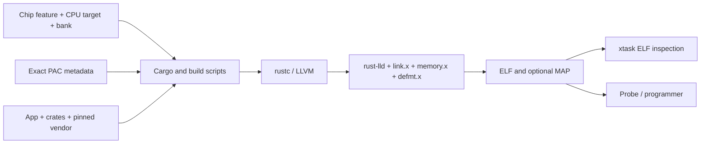

# 4. Architecture

<!-- handbook-nav -->
[Handbook index](README.md) · [简体中文](../zh-CN/architecture.md) · [Project README](../../README.en.md)

To connect an SPI sensor, App first chooses the SPI peripheral, pins and chip selects, then gives them to a driver. The device module parses the returned bytes, an algorithm processes the values, and App decides what to do with the result. Keeping these steps in separate modules lets you retain protocol and algorithm code when changing boards.

Rust calls a compilation unit a crate; it can be a library or an executable. A workspace manages related libraries and applications together. Embassy provides the STM32 HAL, time service and executor used here. The HAL controls peripherals; the executor runs async tasks when they can continue.

## From App to the registers

Arrows mean "uses/depends on." App uses framework crates, which do not depend on App. The diagram omits third-party numerical libraries and build-time dependencies; solid edges show the main runtime dependencies.

Each crate's Cargo manifest, its dependency configuration file, lists the full dependencies. The [application facade](../../crates/embodied-framework/src/lib.rs) mainly re-exports modules so App can reach them through one entry point. It adds no scheduler. `embodied-stm32` accepts configured HAL instances; App selects clocks, pins, DMA memory and the supply configuration.

In the diagram, embedded-hal / embedded-io define common operation interfaces. Rust describes the operations a type must provide through a trait, for example an interface for reading and writing data. stm32-metapac supplies register access code and data for specific STM32 devices. The HAL builds peripheral drivers on top of it.

## Where to put new code

| Module | Code that belongs here | Code handled elsewhere |
|---|---|---|
| App | Configure boards, start tasks, hold application state and choose control targets | Reusable framework mechanisms belong in the appropriate library |
| core | Define initialization order, integer time, synchronous notifications, connection state and communication interfaces | MCU handles and physical pins belong in board code |
| runtime | Exchange messages through queues, wait for locks, pools, semaphores or timers, and manage CAN traffic | App chooses robot actions; common HAL drivers come from upstream |
| algorithms | Calculate control outputs, filters, matrices, estimates and geometry; provide CRC, containers and finite state machines (FSM) | Callers read peripherals and schedule tasks |
| devices | Parse data, construct commands and implement behavior for motors, receivers, referee systems and IMUs | App chooses a particular PCB's SPI/UART pins |
| stm32 | Connect HAL objects to framework interfaces, check required chip capabilities and provide dedicated timers | App chooses motion targets |
| xtask | Run on the development computer to query chips, generate projects, build firmware, inspect ELF files and summarize build coverage | Does not run in the firmware |

For BMI088, App chooses the SPI instance, two chip-selects and whether the bus is shared. The STM32 layer connects these configured resources to the device SPI interface, which the BMI088 driver uses to communicate. Algorithms receive numbers without reading the IMU themselves. Protocol parsing and algorithms can therefore also run independently on the development computer.

## What happens at startup and when data arrives

Cortex-M/Embassy components provide the reset entry and runtime startup. App then uses the nine-stage initialization registry to run platform and device setup in order. Only successful completion returns Ready, which App uses to start its tasks. This depends on App following that startup order; a direct Embassy spawner call can still bypass Ready.

An async task waiting for UART or a timer stores its progress in a Future. A peripheral interrupt (IRQ) or the time service sends a wakeup, and the executor checks whether that Future can continue. This check is called poll. The driver delivers bytes or frames, a parser validates the message, and App updates state, runs algorithms and produces output. Synchronous Signal callbacks run in the caller's context without starting another task.

The diagram shows one way to organize an application. The repository does not yet provide a generic robot controller. App chooses how to divide tasks, define messages and set the control period.

To maintain chip support, tools derive model and capability data from pinned ST sources. Generators and repeatable patches update vendor, and xtask selects exact configurations to build and inspect firmware. A catalogue entry, a linked image and a successful hardware run each need their own checks.

## How source becomes a firmware image

Cargo manages dependencies and invokes the Rust compiler. The linker then places code and data according to linker scripts and produces an ELF file. An optional MAP file lists memory allocation, and xtask inspects the ELF. CPU target means the compiler's processor target; bank means the single-bank or dual-bank Flash layout.

The [root Cargo configuration](../../.cargo/config.toml) supplies linker arguments only for bare-metal ARM builds, so development tools still compile for the host computer. Exact HAL/PAC metadata supplies the chip memory layout, and the HAL build script selects the requested bank configuration. The App build script runs on the host and adds per-core memory partitions for dual-core firmware. It does not handle single-core bank selection. Link addresses must match the actual chip; a roughly similar memory size is insufficient.

When changing chips, review the Rust toolchain file, Cargo.lock, App features, Rust board modules, support policy and generated catalogue together. Cargo features are compile-time switches. Actual clocks, pins, DMA and interrupts are configured in Rust board code.

## Which code comes from upstream

`vendor` stores pinned `embassy-stm32`, `stm32-metapac` and the source produced by applying local patches. The Embassy revision is `ae9e6f0672af84cec8e200a94c574041844396f0`. Ordinary GPIO/UART/SPI/PWM/CAN/USB drivers and the executor mainly reuse upstream implementations.

This framework provides App organization, initialization and communication interfaces, task coordination, algorithms, device protocols and STM32 adapters. Local low-level code mainly adds missing devices, fixes confirmed defects and implements exclusive compare timers. See [provenance and licenses](../../THIRD_PARTY_NOTICES.md) for sources and licensing. Historical patches include excluded devices; their status still follows the current support policy.

## Choices to make in your application

- Queues and pools have fixed capacities, which helps estimate RAM use. App must select those capacities and handle full queues or exhausted resources.
- Rust ownership makes peripheral use explicit. Shared peripherals still need an access order, and drivers and buffers must remain valid throughout their use.
- Async suits peripheral waits. When moving FreeRTOS code, revisit dependencies on forced suspension, thread termination, recursive locks and priority inheritance; the framework does not promise equivalent behavior.
- Protocols and algorithms can be checked on the host first. Electrical behavior, IRQ timing, DMA and physical buses need hardware measurement.
- Support for an MCU means there is a backend and relevant check evidence within the support scope. Check separately whether the chip has the required peripherals and can fit the selected functions together.

Start reading with the minimal App, then init/time and runtime. Follow one UART/CAN/IMU call through its STM32 adapter into HAL. The [next chapter](design-and-implementation.md) explains the implementations.

---

[Previous](board-configuration.md) · [Index](README.md) · [Next](design-and-implementation.md)
