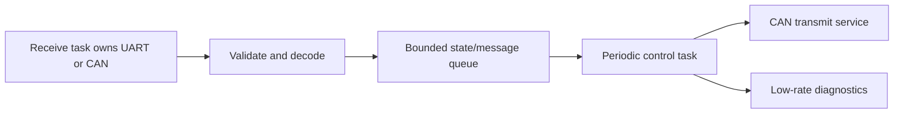

# 6. Best-practice walkthroughs

<!-- handbook-nav -->
[Handbook index](README.md) · [简体中文](../zh-CN/best-practices.md) · [Project README](../../README.en.md)

This chapter explains the two existing firmware entry points. Start with how the minimal heartbeat initializes the chip and starts a task, then see how the reference board creates and stores peripherals. Check the MCU and board revision before building: the two examples use different clock and peripheral configurations.

## Example one: the complete minimal App

The following is the complete [minimal.rs](../../App/src/bin/minimal.rs). Build it with the command below. The task structure and tables later in this chapter guide application design; the repository has no additional firmware entry points for them.

<!-- include-source: App/src/bin/minimal.rs -->

```rust
#![no_std]
#![no_main]

use defmt_rtt as _;
use embassy_executor::Spawner;
use embodied_framework::core::init::{InitRegistry, InitStage};
use embodied_framework::core::time::{Duration, Periodic};
use embodied_framework::runtime::{
    clock::Clock,
    embassy::{EmbassyClock, next_tick},
};
#[cfg(not(embodied_dual_core))]
use embodied_framework::stm32::hal;
use panic_probe as _;

#[cfg(embodied_dual_core)]
#[path = "../dual_core.rs"]
mod dual_core;

#[derive(Default)]
struct Context {
    #[cfg(not(embodied_dual_core))]
    peripherals: Option<hal::Peripherals>,
}

#[embassy_executor::main]
async fn main(spawner: Spawner) {
    let mut context = Context::default();
    let mut init = InitRegistry::<Context, core::convert::Infallible, 4>::new();
    let ready = init
        .run(&mut context, |stage, _ctx| {
            if stage == InitStage::Env {
                #[cfg(embodied_dual_core)]
                dual_core::init();
                #[cfg(not(embodied_dual_core))]
                // Internal oscillator defaults: no external crystal/board assumption.
                {
                    _ctx.peripherals = Some(hal::init(Default::default()));
                }
            }
            Ok(())
        })
        .unwrap();
    ready.start(|| spawner.spawn(heartbeat().unwrap()));
}

#[embassy_executor::task]
async fn heartbeat() {
    let mut schedule = Periodic::new(EmbassyClock.now(), Duration::from_secs(1)).unwrap();
    let mut count = 0_u64;
    loop {
        let tick = next_tick(&mut schedule).await.unwrap();
        count = count.wrapping_add(1);
        defmt::info!("App heartbeat={} missed={}", count, tick.missed);
    }
}
```

<!-- end-source -->

Build at the repository root in a terminal with the toolchain activated:

```text
cargo build -p embodied-app --bin minimal --release --locked --target thumbv7em-none-eabihf --features stm32h723vg
```

### Read it in execution order

1. `no_std/no_main` selects a bare-metal environment and its startup entry point. RTT sends logs through the debug probe, and panic-probe reports program panics.
2. Context stores resources obtained during initialization. Its `Option<Peripherals>` can be empty: peripherals are absent before initialization and present after Env, the hardware-environment stage. The heartbeat only needs time and RTT, so this example leaves those peripherals unused.
3. `InitRegistry<...,4>` can hold up to four initialization callbacks. This example registers none; it performs Env initialization in the closure passed to the initialization process. All nine stages still run in order.
4. `hal::init(Default::default())` uses the HAL's default internal clocks, so it does not depend on a particular board's external crystal. The dual-core branch uses dedicated initialization.
5. Ready is available only after all stages succeed. `ready.start` then submits the heartbeat task to the executor. An initialization error passed to `unwrap` triggers a panic, so the task does not start.
6. `Periodic` tracks scheduled run times, and `next_tick` waits for the next one. Each wakeup follows the original schedule; `missed` counts skipped periods. The heartbeat count starts again from zero after reaching its integer limit. Time calculations check overflow separately.

The example uses a fixed configuration and exposes errors through unwrap. When your application handles external messages or sensor data, decide whether each error needs a retry, a diagnostic record or a stopped function. Ignoring an error can leave the application using invalid data.

## Example two: centralized reference-board resources

[reference_board.rs](../../App/src/bin/reference_board.rs) obtains Peripherals, the resources available for allocation, during Env. It constructs `board::Resources` during Device, the device-initialization stage, then keeps the peripherals alive and periodically reports idle. The H723 configuration also checks the data cache, DCache, during PreCore. This entry point initializes resources and reports status. Add motor control and resource transfers in your own application.

Build STM32G474CE from the repository root:

```text
cargo build -p embodied-app --bin reference-board --release --locked --target thumbv7em-none-eabihf --features board-stm32g474ce
```

This selects G474CE, a 12 MHz HSE (external high-speed clock) and dual-bank Flash. Check these settings against your hardware. G474RE is a different chip model and cannot directly use this board configuration. See [Rust board configuration](board-configuration.md) for the resource table.

In your application, split Resources after obtaining Ready and give CAN, UART receivers and SPI buses to the tasks responsible for them. The board module creates and configures peripherals. Tasks decide when to read and write, and how to process the data.

## Recommended application task structure

The following is a design sketch, not an additional example binary:



The receive task restores interrupted streams, validates packets and records timestamps. The control task stores control state and algorithm instances, while a transmit service schedules outgoing packets. Limit diagnostic logging so it does not slow down frequent processing.

Estimate queue capacity from the message production rate, longest stall and size of each message. Once running, check drop and timeout counters to see whether the capacity is sufficient.

| Decision | Recommended approach | What to observe |
|---|---|---|
| Periodic loop | Periodic/next_tick with an explicit missed-period policy | missed and worst processing duration |
| Full ordinary queue | Handle the result: wait, reject or apply an application drop policy | Drop/timeout counters |
| Full CAN service queue | Use its oldest-waiting-frame discard policy and inspect statistics | dropped, driver_errors, replaced |
| Large message storage | Pass storage borrowed from the pool (a lease) with the message; leaving its scope returns it | available and acquisition timeout |
| Shared SPI | One task manages the bus, or tasks follow a defined access order | CS is asserted and released correctly for each complete transfer |
| Mutex scope | Short holding periods; avoid nested waits for the same lock | Lock waiting and starvation |
| Connection state | Call observe to refresh the connection only after validating the packet | Correct timeout and recovery behavior |
| ISR (interrupt handler) | Do limited work without waiting; give longer processing to tasks | IRQ duration and resource conflicts |

## What to add before product use

Check the reference-board clocks and wiring against your hardware. Decide what to output after a connection failure, how often to retry and which state to resume from. Check physical units, numerical bounds and startup state.

After building, check clocks, DMA, IRQs and CAN/USB communication under real load, and measure variation in the control period. The reference board disables PWM output and uses internal CAN loopback by default. Change those settings explicitly in board configuration when you are ready to drive actual devices.

---

[Previous](design-and-implementation.md) · [Index](README.md) · [Next](ci-cd.md)
