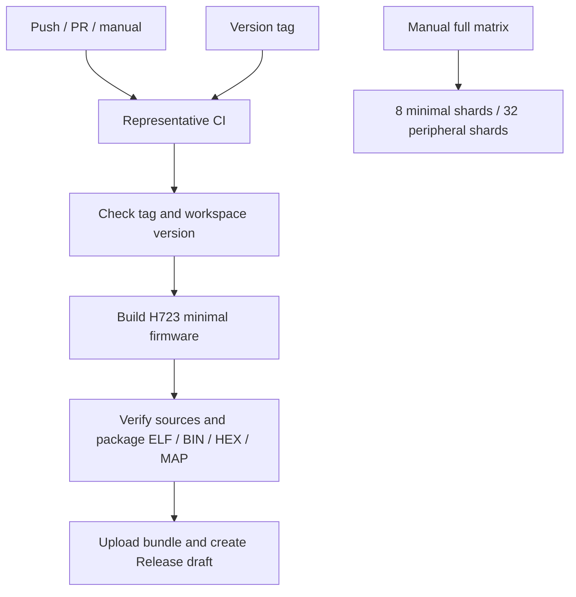

# 7. CI/CD design

[CI/CD design](ci-cd.md) · [目录 / Contents](README.md) · [中文](../zh-CN/ci-cd.md)

After a code submission, GitHub Actions can check formatting, compile code and link firmware automatically. This is CI, continuous integration, which helps find build problems in the current source. A version tag starts a release workflow that packages firmware from the same commit and creates a release draft. That is the CD step used here. A maintainer checks the attachments before publishing.

This chapter describes the configured steps. Check the corresponding Actions results to determine whether a remote run succeeded. These workflows do not connect to a board; flashing and runtime checks are separate work.

## What starts a check

| Workflow | When it runs | What it produces |
|---|---|---|
| [ci.yml](../../.github/workflows/ci.yml) | Push to main, PR, manual start, or a call from another workflow (workflow_call) | Build checks for representative configurations |
| [full-matrix.yml](../../.github/workflows/full-matrix.yml) | Manual start (workflow_dispatch) | Build reports for the selected scope |
| [release.yml](../../.github/workflows/release.yml) | Push a `v*` tag | H723 firmware release draft |



## What daily CI checks

ci.yml defines eight job types. A job can repeat for several operating systems, chips or boards. GitHub Actions calls these parameter sets a matrix, so the total number of runners, the environments executing jobs, exceeds eight.

| Job | Checks performed |
|---|---|
| workflow-lint | Uses actionlint to check workflow syntax, expressions and action inputs; verifies the tool download's SHA |
| host | Checks formatting, documentation links, workspace compilation and USB feature compilation on Ubuntu and Windows, then runs Clippy |
| peripheral-smoke | Checks minimal firmware and seven peripheral types on H723 first, covering dependency preparation, builds and the ELF inspection tool on Linux |
| firmware | Links minimal firmware, inspects ELF files and constructs seven peripheral types for the remaining 25 representative configurations |
| reference-boards | Links release firmware and runs ARM Clippy for five reference boards |
| dual-core | Builds separate H745BG/H747XI core images and compares their shared-memory layouts |
| generated-project | Generates an independent G474 project, checks formatting, builds and links it, runs Clippy and checks that the build did not change generated sources or the lockfile |
| generated-dual-project | Generates two independent paired projects, checks formatting, builds both cores, runs per-core Clippy and verifies sources and lockfiles |

The firmware matrix starts only after peripheral-smoke and both generated-dual-project jobs succeed. If a shared build tool fails, fix the prerequisite job first; skipped jobs do not count as passed checks. H723 plus the 25 matrix configurations still cover the original 26 representative configurations. Before running offline helper projects, CI runs cargo fetch --locked to download the full set of locked dependencies.

Generated dual-core projects use `cargo fmt --check -p ...` for both App packages and their build tool; the host job checks framework source formatting. Using `--all` here would also follow local path dependencies and demand changes to the pinned PAC sources in `Framework/vendor/`.

Clippy is Rust's static code analysis tool. These jobs check compilation, linking, code patterns and source integrity. They do not run phase-specific unit tests, C/C++ comparison projects or dedicated test firmware, so they cannot substitute for behavioral regression tests.

## What to run locally before submitting code

Run these commands at the repository root with the toolchain activated:

```text
cargo fmt --all --check
python scripts/check_docs.py
cargo check --workspace --locked
cargo check -p embodied-stm32 --features usb --locked
cargo clippy --workspace --lib --bins --locked -- -D warnings
```

fmt checks formatting, check verifies that code compiles, and Clippy checks common code problems. These host checks run on the development computer. To confirm that firmware also links for an MCU, build one target separately:

```text
cargo xtask build --chip stm32h723vg
```

If a check fails, start with the first real error in the failed job. Record the step, chip, target, bank and tool versions. For chip-selection conflicts, confirm that only the required chip feature is enabled. Enabling all features combines mutually exclusive configurations.

The generated-project verifier stores hashes, checksums calculated from file contents, for sources and the lockfile. They check that a build leaves the freshly generated project unchanged. Once a user edits App, those contents change and the original generation hashes no longer apply.

## How to check more chips

The full support scope contains 895 models and 921 chip/core configurations. The support policy determines exclusions. The manual workflow divides minimal firmware into eight groups and peripherals into 32 groups. Each group is called a shard, and at most eight peripheral groups run at once.

The commands below run group 0 for minimal firmware and group 0 for peripherals. Select further groups or launch the full workflow when broader coverage is needed:

```text
cargo xtask matrix --shard 0/8
cargo fetch --locked
python xtask/scripts/fetch_source_documents.py
cargo xtask peripherals --shard 0/32
```

Each peripheral configuration constructs GPIO/UART/CAN/USB/SPI/PWM/timer resources for the exact package. A `not-present` result must be supported by chip metadata showing that the peripheral is absent. Construction and linking checks still need to be followed by hardware measurements for actual peripheral operation.

`fail-fast: false` lets other configurations finish after one fails; failed builds still return a nonzero status. `if: always()` lets the upload step attempt to preserve records even after an earlier failure. Manual matrix artifacts are retained for 30 days, and daily firmware-job artifacts for 14 days. Entries without an explicit lifetime follow repository settings.

## How a version tag becomes release attachments

[package_release.py](../../scripts/package_release.py) checks that the tag matches the workspace version, the chip is in scope, and the source is committed with no uncommitted changes. It also requires build reports from that same commit and verifies ELF, MAP and lockfile hashes. The current version is 0.1.0, corresponding to `v0.1.0`; use the matching tag when the version changes.

To check the tag without publishing, run this in PowerShell at the repository root:

```powershell
$env:RELEASE_TAG = 'v0.1.0'
python scripts/package_release.py --check-tag
```

Git Bash / Linux Bash:

```bash
RELEASE_TAG=v0.1.0 python scripts/package_release.py --check-tag
```

Packaging uses LLVM objcopy from the pinned Rust sysroot, the toolchain's installation directory, to export BIN/HEX files. ELF includes debugging information, HEX includes write addresses, BIN has no addresses, and MAP lists memory allocation. The source commit, tool versions and SHA256SUMS help identify which source produced the attachments and whether the files are intact.

Only `stm32h723vg` minimal firmware is currently packaged; its BIN cannot be used for other chip models. Checks default to read-only `contents: read` permissions. Only the job creating the release draft uses `contents: write`. A maintainer reviews attachments before publishing manually. The workflow does not connect to a probe.

## What to do when build caches use too much space

CI sets `EMBODIED_CACHE_LIMIT_MIB=1024`. Managed builds use this threshold to reclaim caches before the next build starts; the local default is 2048. A single build can still exceed it, and it does not limit the combined space of all parallel runners or the whole repository.

There is no cross-run `actions/cache`. Keep the final artifacts you need to deliver, then remove `target/` as needed after confirming that no build is using it. See [storage](../storage.md).

---

[Best practices](best-practices.md) · [目录 / Contents](README.md) · [Troubleshooting](troubleshooting.md)
