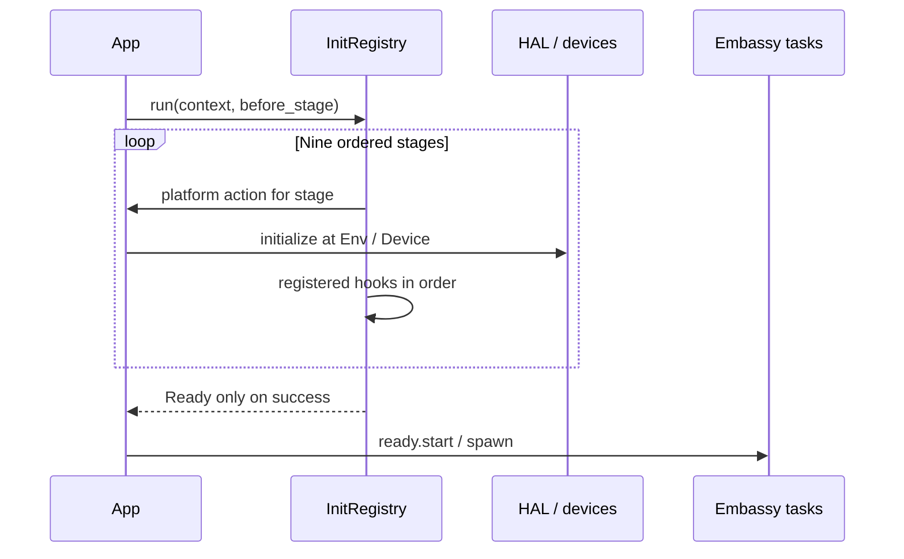

# 5. Design and implementation

<!-- handbook-nav -->
[Handbook index](README.md) · [简体中文](../zh-CN/design-and-implementation.md) · [Project README](../../README.en.md)

When writing a task, you need to know who can use a peripheral, what the CPU does during a wait, what happens when a queue fills, and whether a resource can still be used after a timeout. This chapter explains those behaviors and links to their implementations. Actual peripheral capabilities depend on the selected MCU.

## Who can use a peripheral after a task receives it

C applications often access a global HAL handle from several functions. Here, initialization usually obtains a unique value representing access to a peripheral, called a token. It constructs a driver and hands that driver to a task. Rust calls this handoff a move: the receiver takes ownership, and the original variable can no longer use that value.

Borrowing lets code access a value temporarily. `&mut` is an exclusive borrow: during that borrow, changes must go through it. `'static` means the referenced data can remain valid throughout the program. These checks help manage how long drivers and buffers are used. The hardware's pin, clock and DMA requirements still apply.

| Common C/RTOS pattern | Approach used here |
|---|---|
| Access a global HAL handle from several places | Obtain a unique token, construct the driver and move it into the task that uses it |
| Manage messages with `malloc/free` | Prepare a fixed-capacity queue or pool, with automatic return after use |
| Release an acquired resource manually | Keep a guard or permit object while using the resource; destroying the object returns it |
| Give each thread a stack and block it during waits | Async functions save the state they need and let the executor run other tasks while waiting |
| Kill a thread | Arrange cooperative exit or drop a pending Future, then handle any started operation according to its interface |

Automatic return uses Drop, the cleanup Rust runs when a value is destroyed, such as when a guard leaves scope or a function returns an error. The pools, locks and semaphores below use this mechanism.

## What happens while a task waits

An async function is compiled into a Future that stores its execution progress. The executor checks whether it can continue, an operation called poll. If an awaited operation has not finished, it returns Pending. The executor can run other tasks and check this one again after a wakeup.

An `.await` on an already completed operation may continue immediately. It yields only when the awaited operation returns Pending. Busy loops, long blocking calls and lengthy computations still delay other tasks on the same executor. The framework does not promise preemptive priority scheduling. A Future also stores state needed across `.await`, so large buffers can increase its storage requirements.

## How to budget RAM without a heap

Firmware uses `no_std`, so it does not depend on the Rust standard library or operating-system services. Core and runtime forbid unsafe code. Fixed arrays, `heapless` containers and compile-time const capacities hold resources without requiring a heap by default. Application-supplied message or callback types can still allocate independently.

Include the queue's `N × message size`, pools, task state, USB descriptors and DMA buffers in the RAM budget. On small devices, enable only the needed functions and inspect memory usage in the actual ELF. A feature is a Cargo compile-time switch. Chip features are mutually exclusive; the facade's default features do not enable STM32.

## How initialization failure prevents application startup

[init.rs](../../crates/embodied-core/src/init.rs) stores startup functions, called hooks, in `InitRegistry<C,E,N>`. C is the shared initialization context, E is the error type, and N is the maximum number of registered hooks. With `N=0`, platform actions still run through all nine stages.

The fixed order is PreCore → PostCore → PreEnv → Env → PostEnv → PreDevice → Device → PostDevice → Late. Each stage runs its platform action, then its hooks in registration order. The first error returns the stage and optional hook name. Later stages stop, and no Ready is returned. Once a registry has started running, it cannot retry.

Ready is a token obtained only after initialization completes. `Ready::start` consumes it and runs the supplied closure once. A closure is a piece of code supplied by the caller. Put application task startup inside that closure so initialization failure prevents it from running. Calling a raw spawner directly can still bypass this path.

Hooks are synchronous and cannot directly await async initialization. If a device also needs an async startup handshake, App must complete that handshake before enabling dependent operations.

## When a periodic task runs late

[time.rs](../../crates/embodied-core/src/time.rs) stores Instant, a point in time, and Duration, a length of time, as `u64` microseconds. It checks time arithmetic for overflow. `Periodic` keeps the absolute time when the next execution is due, called the deadline, and the period between executions.

For a start of 0 ms and a period of 10 ms, suppose the task first gets to run at 35 ms. It receives one tick with scheduled=10 ms, observed=35 ms and missed=2. The 20 ms and 30 ms executions have been skipped, and the next deadline is 40 ms. It does not run three catch-up iterations or move the next deadline to 45 ms. App decides how to handle the missing samples.

The [Embassy adapter](../../crates/embodied-runtime/src/embassy.rs) waits for an absolute time in `next_tick`, then checks the schedule again. Clock conversion uses `u128` intermediates, rounds deadlines upward and observations downward. A zero period returns an error. Out-of-range times also need handling: try_deadline can check a deadline first, while EmbassyClock's wait path panics if a deadline is unrepresentable. Overflowing `from_millis/from_secs` conversions also panic, so validate external time values first.

## How two tasks exchange messages

One task can put a received message in a queue for another task to process. [queue.rs](../../crates/embodied-runtime/src/queue.rs) provides `Queue<T,N>`, a fixed-capacity deque holding at most N values of type T. Use SharedQueue when several tasks need access. It protects queue state with short critical sections so a modification cannot be accessed concurrently.

`try_send/try_receive` return immediately without waiting for space or data. If `send/receive` cannot complete yet, they register a waker and return Pending. A waker holds the information needed to wake the task; after space or data becomes available, the executor can run the waiter again. SharedQueue behaves as follows:

| Situation | Result |
|---|---|
| Queue is full during `try_send` | Returns the unsent T and keeps the old messages |
| `send_timeout` expires | Returns `SendError<T>` carrying the unsent value |
| Timeout and required resource become ready together | Reports the timeout first |
| Drop a send that is still waiting | Drops the unsent value once |
| Drop a receive that is still waiting | Removes no message |
| `peek` | Clones the current front value; another receiver may then remove the original |
| `clear` | Removes all contents atomically, drops them after releasing the queue borrow and wakes senders |

The timeout argument is a `Future<Output=()>`: a wait that completes without returning data, such as an Embassy Timer. It cannot be a raw millisecond count. Each wait set allows eight pending operations, with separate sets for senders and receivers. Exceeding that limit returns `TooManyWaiters`. Waiters are not guaranteed to continue in arrival order.

Inside an interrupt service routine (ISR), use only nonwaiting interfaces. The platform critical-section implementation and wakers must support ISR calls. Message cloning and callbacks must also finish in bounded time.

## How a used message returns to its pool

For repeated message exchange, you can prepare a group of message objects, take one when needed and return it after use. [pool.rs](../../crates/embodied-runtime/src/pool.rs) stores them in `[Option<T>;N]`. Some(T) means a slot contains a message; None means it is empty.

Acquiring a message removes a value from a Some slot and returns a MessageLease. The lease represents the caller's ownership of that message. It cannot be cloned to create another independent owner. Deref/DerefMut provide access to the message. When the lease runs Drop, it returns the message to an empty slot and wakes waiters. Normal scope exit, error returns and cancellation of a Future holding the lease all use this return path.

The lease holds the message value and a reference to its pool, with no manual double-release interface. None entries passed to `from_slots` add empty slots, not available messages. Deliberately forgetting a lease skips Drop and loses that pool capacity.

## How tasks take turns using a shared resource

Use [AsyncMutex](../../crates/embodied-runtime/src/mutex.rs) when only one task should use a resource at a time. It stores an Option<T>. Acquiring the lock removes T and places it in a guard. Other tasks wait until the guard runs Drop and puts T back.

Critical sections protect only the handoff and return; they do not stay active across `.await`. The lock itself remains held until the guard is destroyed. Awaiting another operation that needs the same lock while keeping the guard can deadlock. Keep guard lifetimes short. This mutex does not support recursive locking or promise priority inheritance or allocation in waiter arrival order.

When N resources can be used at the same time, use [CountingSemaphore](../../crates/embodied-runtime/src/semaphore.rs). It starts with N permits; acquisition returns a Permit whose Drop returns capacity. It limits concurrent resource use. FreeRTOS code that uses arbitrary event-count `give/take` operations needs adaptation. Timeout or cancellation removes the corresponding waiter registration.

## How received messages notify other code

[Signal](../../crates/embodied-core/src/signal.rs) lets callers register callbacks and invokes them synchronously in registration order. The FnMut callback type can update its own state. A subscription may run once or for a specified N calls. Signal has no background task, and callbacks cannot `.await`. Put lengthy work in a queue for another task to process.

The callback references remain borrowed for the Signal lifetime. Even after unsubscribe stops calls to a callback, Rust's type checking does not end that borrow early.

To detect an offline device, [ConnectionGuard](../../crates/embodied-core/src/connection.rs) records the last valid packet time. It reports offline before any valid packet, at the timeout boundary, or if the current time precedes the recorded time. It does not check CRC, so update the timestamp only after successful protocol parsing.

## Can an old timer event run after stop

[TimerScheduler](../../crates/embodied-runtime/src/timer.rs) stores software timers in fixed slots. One dispatcher task waits for the next timer to expire. Starting, stopping or changing a period updates its generation, a version number for the timer's current settings. Dispatch checks this version and rejects events from an older version.

Callbacks run outside critical sections. Stop suppresses an old event until dispatch commits it for execution. After that point, stop cannot withdraw it, even if the callback has not started yet. Periodic timers skip missed periods.

TimerId records both an index and its owning scheduler so equal indices from different schedulers cannot be mixed. Registration capacity is limited, and each ID occupies its slot until the scheduler is destroyed. Use one central dispatcher to wait for and execute events.

For a dedicated hardware compare interrupt, [HardwareAlarm](../../crates/embodied-runtime/src/hardware_timer.rs) exclusively borrows a HardwareTimerChannel. Its first poll arms the channel, meaning it sets and enables the timed compare. Completion, failure or dropping a pending Future cancels the attempted arm. The [STM32 implementation](../../crates/embodied-stm32/src/hardware_timer.rs) disarms compare, clears flags, removes wakers and rejects stale IRQs. This channel cannot be shared with the executor's timebase.

Cancelling an ordinary Embassy time wait can leave a stale wakeup. The software scheduler rechecks deadlines and generations to avoid delivering an old event. A dedicated hardware channel instead disarms compare directly. Choose the timer according to the cancellation behavior you need.

## What happens to data already sent when communication times out

[Core communication interfaces](../../crates/embodied-core/src/communication.rs) define CAN transmit, receive and error operations. STM32 adapters connect configured HAL objects to these interfaces. UART/USB provide async byte streams, while SPI/CS/PWM connect to device interfaces through embedded-hal. App configures the peripheral first, then creates an adapter, an object that connects the two interfaces.

[CanTxService](../../crates/embodied-runtime/src/can.rs) defaults to 12 waiting frames and one separate slot for the frame currently being attempted, called the in-flight frame. If the waiting queue fills, it discards and counts the oldest waiting frame while keeping the in-flight frame. SharedQueue handles this differently: its try_send returns the new message to the caller when full.

Each service allows one transmitter worker, the task that takes frames and calls the driver. Cancellation or driver error keeps the in-flight frame for a later worker to retry. To abandon it, use the discard interface. `sent` counts frames accepted by the driver; bus ACK and motor execution need separate observation.

UART/USB cancellation can occur after some bytes have transferred. App must find the protocol frame boundary again or perform recovery; it cannot assume all data was withdrawn. SPI's CS guard attempts to restore high on cancellation, but Drop cannot return a GPIO error to the caller. Plan timeout handling around the behavior of the interface in use.

## How device readings reach an algorithm

Device modules handle protocol lengths, byte order, CRC, numeric ranges and connection state. Algorithms receive numbers. Neither owns board pins. App chooses units, sampling periods, recovery after errors and the final control outputs. See [algorithms](../algorithms.md) and [devices](../devices.md).

---

[Architecture](architecture.md) · [目录 / Contents](README.md) · [Best practices](best-practices.md)
