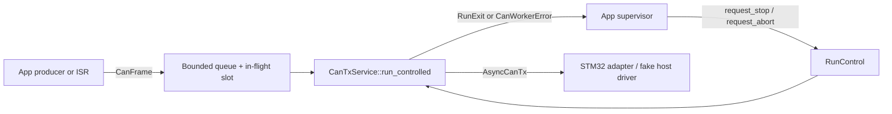
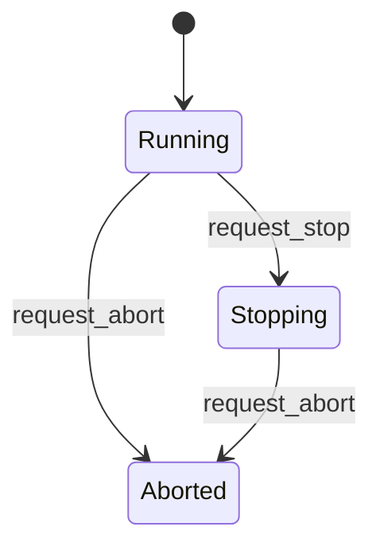

# 运行控制与设计依据 / Runtime control and design evidence

[文档目录 / Documentation](README.md) · [中文架构](zh-CN/architecture.md) · [English architecture](en/architecture.md)

本次代码改动为 CAN 发送 worker 增加独立的运行控制上下文，并用确定性的主机测试验证取消、恢复和超时。下面的来源都是固定提交中的具体符号；“借鉴”指接口思想或测试方法，不表示移植了对方的实现。

This change adds an independent lifecycle context to the CAN transmit worker and deterministic host checks for cancellation, recovery and timeouts. Sources below identify concrete symbols at fixed commits. Inspiration means an interface principle or testing method, not a port of the referenced implementation.

## 依据到代码的映射 / Evidence-to-code mapping

| 来源与可核对事实 / Source and observable fact | 本次采用的思想 / Adopted principle | rivet32 落点与适配 / Implementation and adaptation |
|---|---|---|
| Dynamo `519e735550c1a4aac67c2fd37d4a56ed0a014653`：[engine.rs 的 AsyncEngineContext](https://github.com/ai-dynamo/dynamo/blob/519e735550c1a4aac67c2fd37d4a56ed0a014653/lib/runtime/src/engine.rs#L105-L154) 单独定义 `stop_generating`、`kill` 和状态查询；停止生成保留已有结果，kill 的无排空语义由实现决定。 / A separate context exposes lifecycle requests and status; stopping retains existing results, while kill behavior is implementation-specific. | 控制生命周期与传输数据分开，区分协作停止和中止。 / Separate lifecycle control from payloads and distinguish graceful stop from abort. | 新增 [RunControl / RunState / RunExit](../crates/embodied-runtime/src/control.rs) 与 [CanTxService::run_controlled](../crates/embodied-runtime/src/can.rs)。本项目定义为“完成当前一次发送后停止”或“取消 Pending 并保留帧”；没有层级 context、动态分发或堆分配。 / A borrowed, bounded context controls one-frame stop boundaries or cancellation with retained frames; no context hierarchy, dynamic dispatch or allocation. |
| Warp `b865631c9a0e46b548c7ec7dc32e228a148171d1`：[OnCancelFuture](https://github.com/warpdotdev/warp/blob/b865631c9a0e46b548c7ec7dc32e228a148171d1/crates/warp_util/src/on_cancel.rs#L27-L60) 记录 Future 是否返回 Ready；[测试](https://github.com/warpdotdev/warp/blob/b865631c9a0e46b548c7ec7dc32e228a148171d1/crates/warp_util/src/on_cancel_tests.rs#L7-L34) 区分正常完成与首次 poll 前取消。 / Tracks Ready versus Drop before completion; tests distinguish completion from cancellation before first poll. | 把取消当成可验证的生命周期分支，并检查清理是否恰好发生一次。 / Treat cancellation as an observable lifecycle branch with exactly-once cleanup checks. | 新增 [runtime 主机测试](../crates/embodied-runtime/tests/runtime_async.rs) 验证首次 poll 前、Pending 后、完成后的 Drop，以及 CAN 中止/重启、资源池归还和等待槽复用。Pending、驱动失败和同 poll 竞态覆盖是本项目的扩展。 / Host tests extend this approach to pending operations, driver failures, same-poll races, leases and waiter reuse. |
| 同一 Warp 提交的 [time.rs](https://github.com/warpdotdev/warp/blob/b865631c9a0e46b548c7ec7dc32e228a148171d1/crates/warpui_core/src/time.rs#L8-L29)：生产调用 `Utc::now`，测试通过 `test_offset_time` 推进时间。 / Production reads real time; tests advance a controlled value. | 时间由测试驱动，避免依赖真实睡眠和调度速度。 / Drive time explicitly instead of depending on real sleeps or scheduler speed. | [测试辅助模块](../crates/embodied-runtime/tests/common/mod.rs) 通过已有 [Clock trait](../crates/embodied-runtime/src/clock.rs) 实现单调的手动时钟，支持等待唤醒和 Drop 注销。与 Warp 的墙上时间辅助函数不同，这里用于异步 deadline 测试。 / A host-only monotonic clock implements the existing trait, wakes sleepers and unregisters dropped waits; it adapts the idea to async deadlines. |

`core/devices/algorithms/stm32` 分层、`AsyncCanTx`、`Clock`、`MessageLease::drop`、CAN 的 in-flight 保留机制以及 `WaitQueue` 在本次改动前就已存在。它们是新增控制与测试复用的基础，不应归因为本次从 Dynamo 或 Warp 引入。新增生产行为集中在 `control.rs` 与 `run_controlled`；旧的 `run`、`send_next` 接口继续可用。

The crate layering, `AsyncCanTx`, `Clock`, `MessageLease::drop`, CAN in-flight retention and `WaitQueue` all predate this change. They are reused foundations, not features newly borrowed from Dynamo or Warp. New production behavior is concentrated in `control.rs` and `run_controlled`; existing `run` and `send_next` remain available.

## 数据与控制分离 / Separate data and control



`RunControl::state()` 表示请求状态，不是 worker 已完成的证明。调用方应等待 `run_controlled` 返回 `RunExit` 或错误，才认为 worker 释放了所有权。控制对象不关闭入队接口，也不清空队列；生产者停止与否由 App 决定。

`RunControl::state()` describes the requested state, not completion. Await `run_controlled` for its exit or error before treating the worker as released. The control does not close admission or clear the queue; App decides whether producers should stop.

## 状态与边界 / States and boundaries



请求是幂等的；`request_stop` 不会把 Aborted 降级，控制对象没有 reset。重启使用新的 `RunControl`，避免旧请求或旧等待者意外控制新一轮运行。每个控制对象使用固定容量等待槽；超过 `MAX_WAITERS` 时返回 `WaitError::TooManyWaiters`，worker 将其作为 `CanWorkerError::Wait` 返回。平台仍须提供 `critical-section` 实现。

Requests are idempotent, stop never downgrades Aborted, and there is no reset. Use a new context for a restart so old requests/waiters cannot affect a new run. The context uses bounded waiter storage: exceeding `MAX_WAITERS` returns `WaitError::TooManyWaiters`, propagated by the worker as `CanWorkerError::Wait`. The platform must still supply `critical-section`.

| 观测时刻 / Observation point | 行为 / Behavior |
|---|---|
| 选取帧前或空闲时收到 stop / Stop before selecting a frame or while idle | 返回 Stopped，队列和已有重试帧保持不变。 / Return Stopped, preserving queued and retry frames. |
| 已选取帧、驱动 Pending 时收到 stop / Stop after selecting a frame while transmit is Pending | 允许当前一次发送完成，然后退出，不再选下一帧。 / Finish the current attempt, then exit without selecting another frame. |
| 下一次轮询驱动前观测到 abort / Abort observed before polling the driver | 返回 Aborted，丢弃 Pending Future，保留未被接受的 in-flight 帧以便恢复。 / Return Aborted, drop the pending future and retain the unaccepted frame for recovery. |
| 驱动 poll 内收到 abort，但同一次 poll 已返回 Ready(Ok) / Abort arrives inside a driver poll that returns Ready(Ok) | 先提交接受结果与统计，再退出；已被接受的帧不能重新放回重试。 / Commit acceptance and statistics before exiting; never retry the accepted frame. |
| 驱动返回错误 / Driver error | 返回 Driver 错误，保留帧并释放 worker；由 App 决定退避、换驱动或显式丢弃。 / Return a Driver error, retain the frame and release the worker; App chooses backoff, driver replacement or explicit discard. |

协作 stop 没有硬期限：驱动一直 Pending 时也会一直等待，调用方可升级为 abort。控制是协作式的，不能抢占一个正在运行的 `poll`。中止遵守已有 `AsyncCanTx` 约定：Pending 时帧尚未被驱动接受；接受和 Ready 必须在同一次 poll 内发生。它不撤销已经被硬件接受的传输，也不代表电机急停。

Graceful stop has no deadline and may wait indefinitely for a Pending driver; the caller can escalate to abort. Control is cooperative and cannot preempt a running `poll`. Abort relies on the existing `AsyncCanTx` contract: Pending has not accepted the frame, and acceptance and Ready occur in the same poll. It does not undo hardware-accepted transmissions or implement a motor emergency stop.

## 运行与验证 / Run and verify

仓库根目录执行；测试和示例使用主机端 `critical-section/std`，该 dev-dependency 不对 `target_os = "none"` 启用。生产库保持 `no_std`，未增加运行时依赖。

Run from the repository root. Tests/examples use the host `critical-section/std` dev-dependency, disabled for `target_os = "none"`. The production library stays `no_std` with no new runtime dependencies.

```text
cargo test -p embodied-runtime --tests --locked
cargo clippy -p embodied-runtime --tests --examples --locked -- -D warnings
cargo run -p embodied-runtime --example controlled_can --locked
```

[controlled_can.rs](../crates/embodied-runtime/examples/controlled_can.rs) 使用假驱动和显式 poll 演示“完成一帧后停止 → 中止下一帧 → 重启恢复”，预期输出如下。此示例不是完整执行器，不需要板卡。

[controlled_can.rs](../crates/embodied-runtime/examples/controlled_can.rs) manually polls a fake driver to demonstrate stop after one frame, abort the next attempt, then recover. It is not a complete executor and needs no board. Expected output:

```text
graceful stop: accepted=1, queued=1
abort: pending frame retained, accepted=1
recovery: accepted=2, no duplicated frame
```

主机测试验证状态、资源归还、唤醒与帧计数；ARM 编译验证裸机兼容性。真实驱动是否满足取消约定、IRQ/DMA 时序及总线 ACK 仍须上板验证。详细 PoC 路径见[运行说明](poc.md)。

Host tests cover state, resource returns, wakes and frame accounting; ARM compilation checks bare-metal compatibility. Real-driver cancellation compliance, IRQ/DMA timing and bus acknowledgement still require hardware validation. See the [PoC guide](poc.md) for the build path.
