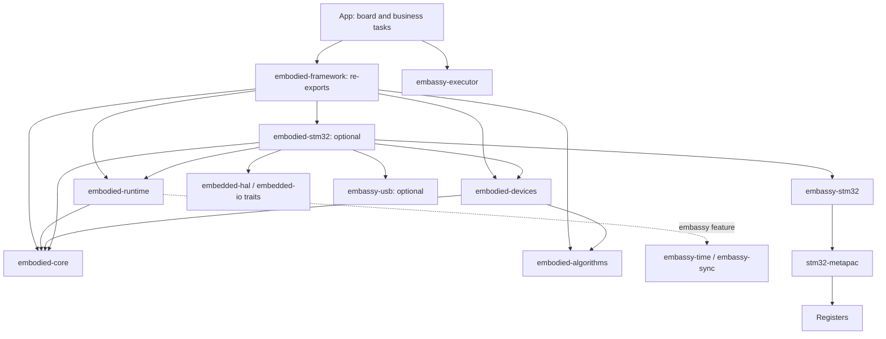
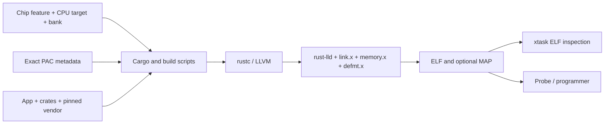

# 4. 架构设计

<!-- handbook-nav -->
[手册目录](README.md) · [English](../en/architecture.md) · [项目首页](../../README.md)

接入一个 SPI 传感器时，先在 App 中选好 SPI、引脚和片选，再交给驱动读取数据。设备模块解析读回的字节，算法处理解析后的数值，App 决定如何使用结果。这几个步骤分别放在不同目录，换板时就能保留协议和算法代码。

Rust 把一次编译的代码单元称为 crate，可以是库，也可以是可执行程序；workspace 把相关的库和应用工程放在一起管理。这里的 Embassy 提供 STM32 HAL、时间服务和执行器。HAL 负责操作外设，执行器负责在异步任务可以继续时运行它们。

## 从 App 调用到寄存器

下图箭头表示“使用/依赖”。App 可以使用框架库，框架库不依赖 App。图中省略了第三方数值库和构建时依赖，实线展示主要运行依赖。

各 crate 的 Cargo manifest，也就是依赖配置文件，记录了完整依赖。[聚合入口](../../crates/embodied-framework/src/lib.rs)主要把各库的模块重新导出，方便 App 从一个入口使用；它没有额外的任务调度器。`embodied-stm32` 接收已配置的 HAL 实例，App 负责选择时钟、引脚、DMA 内存和电源配置。

图中的 embedded-hal / embedded-io 定义通用操作接口。Rust 用 trait 描述一个类型必须提供哪些操作，例如读写数据。stm32-metapac 则提供具体 STM32 的寄存器访问代码和芯片数据，HAL 在它之上实现外设驱动。

## 新代码应该放在哪里

| 模块 | 适合放入的代码 | 交给其他模块的部分 |
|---|---|---|
| App | 配置板卡、启动任务、保存业务状态，决定控制目标 | 可复用的框架机制放入相应库 |
| core | 规定初始化顺序、整数时间表示、同步通知、连接状态和通信接口 | MCU 句柄和实际引脚留在板级代码 |
| runtime | 让任务通过队列交换消息，等待锁、资源池、信号量或定时器；管理 CAN 收发 | 机器人动作由 App 决定，通用 HAL 驱动复用上游 |
| algorithms | 根据数值做控制、滤波、矩阵运算、估计和几何计算，也提供 CRC、容器与状态机（FSM） | 读取外设和安排任务由调用方完成 |
| devices | 按电机、遥控器、裁判系统或 IMU 的协议解析数据、构造命令，处理设备行为 | 某块 PCB 的 SPI/UART 引脚由 App 选择 |
| stm32 | 把 HAL 对象接到框架通信和设备接口，检查芯片是否具备所需能力，提供专用定时器 | 运动目标由 App 决定 |
| xtask | 在电脑上查询芯片、生成工程、构建固件、检查 ELF，并汇总构建覆盖范围 | 不参与固件运行 |

以 BMI088 为例，App 选择 SPI 实例、两个片选，并决定总线是否共享。STM32 层把这些已配置的资源接到设备 SPI 接口，BMI088 驱动通过该接口通信。算法只接收数值，不自行读取 IMU。因此，协议解析和算法也能在电脑上独立使用。

## 上电和收到数据后分别会发生什么

复位入口和运行时启动由 Cortex-M/Embassy 支持。进入 App 后，九阶段初始化注册表按顺序执行平台和设备初始化。全部成功才返回 Ready，App 再用它启动业务任务。Ready 的作用依赖 App 按这个顺序组织启动代码；直接调用 Embassy spawner 仍能绕过它。

等待 UART 或定时器的异步任务会保存进度，形成一个 Future。外设中断（IRQ）或时间服务发出唤醒通知后，执行器再次检查这个 Future 是否可以继续，这一步称为 poll。驱动交付字节或帧，解析器检查消息，App 再更新状态、运行算法并生成输出。Signal 的同步回调直接在调用它的上下文中执行，不会自动启动另一个任务。

图中给出了一种组织应用的方式。仓库尚未提供通用机器人控制任务，任务如何拆分、消息长什么样、控制周期多长，都由 App 决定。

维护芯片支持时，工具从固定的 ST 来源整理型号和能力数据，用生成器及可重复应用的补丁更新 vendor，再由 xtask 选择准确配置并构建、检查固件。芯片出现在目录中、固件能够链接、板上实际运行通过，需要分别检查。

## 固件怎样编译成可下载文件

Cargo 管理依赖并调用 Rust 编译器。编译后，链接器按照链接脚本放置代码和数据，生成 ELF；可选的 MAP 文件列出内存分配，xtask 会检查 ELF。这里的 CPU target 指编译器使用的处理器目标，bank 指 Flash 的单 bank 或双 bank 布局。

[根配置](../../.cargo/config.toml)只为 ARM 裸机构建提供链接参数，因此在电脑上运行的工具仍按主机编译。芯片的准确内存布局来自 HAL/PAC 元数据，HAL 构建脚本根据所选 bank 配置生成布局。App 构建脚本在电脑上运行，额外处理双核固件各自的内存分区；单核 bank 选择不在该脚本中处理。链接地址必须符合实际芯片，不能用容量相近的布局替代。

更换芯片时，需要一起检查 Rust 工具链文件、Cargo.lock、App feature、Rust board 模块、支持策略和生成的芯片目录。Cargo feature 是编译时开关；时钟、引脚、DMA 和中断的实际配置仍写在 Rust 板级代码中。

## 哪些代码来自上游

`vendor` 保存固定版本的 `embassy-stm32`、`stm32-metapac` 以及应用补丁后的源码。Embassy revision 固定为 `ae9e6f0672af84cec8e200a94c574041844396f0`。普通 GPIO/UART/SPI/PWM/CAN/USB 驱动和执行器主要复用上游实现。

本框架提供 App 组织方式、初始化和通信接口，以及任务协作机制、算法、设备协议和 STM32 适配代码。本地底层代码主要补充缺失型号、修复已确认问题，并实现独占使用的 compare 定时器。具体来源和许可见[来源与许可证](../../THIRD_PARTY_NOTICES.md)。历史补丁中含有已排除型号的代码；这些型号仍以当前支持策略为准。

## 使用时需要做的选择

- 队列和资源池容量固定，便于估算 RAM。App 需要选择容量，并处理满队列或资源耗尽。
- Rust 所有权明确了外设由谁使用。需要共享外设时，还要安排访问顺序，并保证驱动和缓冲区在使用期间一直有效。
- async 适合等待外设。迁移 FreeRTOS 代码时，需要重新处理强制挂起、线程终止、递归锁和优先级继承等依赖，框架没有承诺这些行为完全等价。
- 协议和算法可以先在电脑上验证；电气、IRQ 时序、DMA 和总线行为仍需要上板测量。
- 支持某个 MCU 表示它有对应后端和支持范围内的检查记录。外设是否存在、所选功能能否同时装入该芯片，还要分别确认。

阅读源码时，可以先看最小 App，再看 init/time 和 runtime，最后沿一个 UART/CAN/IMU 调用追到 STM32 适配与 HAL。实现细节见[下一章](design-and-implementation.md)。

---

[上一章](board-configuration.md) · [目录](README.md) · [下一章](design-and-implementation.md)
