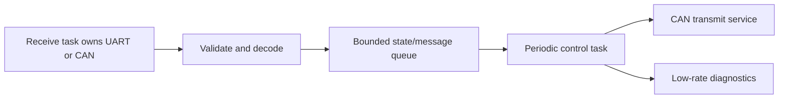

# 6. 最佳使用示范

<!-- handbook-nav -->
[手册目录](README.md) · [English](../en/best-practices.md) · [项目首页](../../README.md)

本章解释两个现有固件入口。先看最小心跳怎样完成初始化并启动任务，再看参考板怎样创建和保存外设。构建前确认芯片型号和板版本，两份固件使用的时钟和外设配置不同。

## 案例一：完整最小 App

下面是 [minimal.rs](../../App/src/bin/minimal.rs) 的完整源码，可以用后面的命令构建。本章后半部分的任务划分和表格用于指导应用设计，仓库没有对应的额外固件入口。

<!-- include-source: App/src/bin/minimal.rs -->

```rust
#![no_std]
#![no_main]

use defmt_rtt as _;
use embassy_executor::Spawner;
use embodied_framework::core::init::{InitRegistry, InitStage};
use embodied_framework::core::time::{Duration, Periodic};
use embodied_framework::runtime::{
    clock::Clock,
    embassy::{EmbassyClock, next_tick},
};
#[cfg(not(embodied_dual_core))]
use embodied_framework::stm32::hal;
use panic_probe as _;

#[cfg(embodied_dual_core)]
#[path = "../dual_core.rs"]
mod dual_core;

#[derive(Default)]
struct Context {
    #[cfg(not(embodied_dual_core))]
    peripherals: Option<hal::Peripherals>,
}

#[embassy_executor::main]
async fn main(spawner: Spawner) {
    let mut context = Context::default();
    let mut init = InitRegistry::<Context, core::convert::Infallible, 4>::new();
    let ready = init
        .run(&mut context, |stage, _ctx| {
            if stage == InitStage::Env {
                #[cfg(embodied_dual_core)]
                dual_core::init();
                #[cfg(not(embodied_dual_core))]
                // Internal oscillator defaults: no external crystal/board assumption.
                {
                    _ctx.peripherals = Some(hal::init(Default::default()));
                }
            }
            Ok(())
        })
        .unwrap();
    ready.start(|| spawner.spawn(heartbeat().unwrap()));
}

#[embassy_executor::task]
async fn heartbeat() {
    let mut schedule = Periodic::new(EmbassyClock.now(), Duration::from_secs(1)).unwrap();
    let mut count = 0_u64;
    loop {
        let tick = next_tick(&mut schedule).await.unwrap();
        count = count.wrapping_add(1);
        defmt::info!("App heartbeat={} missed={}", count, tick.missed);
    }
}
```

<!-- end-source -->

在已激活工具链的终端、仓库根目录构建：

```text
cargo build -p embodied-app --bin minimal --release --locked --target thumbv7em-none-eabihf --features stm32h723vg
```

### 按执行顺序阅读

1. `no_std/no_main` 让固件使用裸机环境和专用启动入口。RTT 通过调试探针输出日志，panic-probe 用于在程序发生 panic 时报告错误。
2. Context 用来暂存初始化得到的资源。`Option<Peripherals>` 可以为空：初始化前没有外设资源，Env（硬件环境初始化阶段）之后有资源。本例的心跳只使用时间和 RTT，暂时不取用这些外设。
3. `InitRegistry<...,4>` 最多可以登记四个初始化回调。本例没有登记回调，而是用传给初始化过程的闭包完成 Env 操作。框架仍会依次执行全部九个阶段。
4. `hal::init(Default::default())` 使用 HAL 默认的内部时钟，因此不依赖某块板上的外部晶振。双核分支使用专用初始化。
5. 只有所有阶段成功后才会得到 Ready，随后 `ready.start` 把心跳任务交给执行器。初始化中 `unwrap` 遇到错误会触发 panic，任务不会启动。
6. `Periodic` 记录预定的运行时间，`next_tick` 等待下一次运行。每次唤醒都沿用原来的时间安排，`missed` 记录跳过的周期。心跳计数达到整数上限后从零继续，时间计算仍单独检查溢出。

示例使用固定配置，通过 `unwrap` 暴露错误。自己的应用接收外部报文或传感器数据时，应根据错误类型决定是否重试、记录原因或停止相关功能，避免忽略错误后继续使用无效数据。

## 案例二：参考板把资源集中构造

[reference_board.rs](../../App/src/bin/reference_board.rs) 在 Env 获取 `Peripherals`，也就是可供分配的外设资源；在 Device（设备初始化阶段）调用 `board::Resources::new` 创建具体外设，随后保存它们并周期打印 idle。H723 配置还在 PreCore 阶段检查数据缓存 DCache 的状态。这个入口的任务是初始化资源和输出状态，电机控制及资源移交需要在自己的应用中添加。

在仓库根目录构建 STM32G474CE：

```text
cargo build -p embodied-app --bin reference-board --release --locked --target thumbv7em-none-eabihf --features board-stm32g474ce
```

此命令选择 G474CE、12 MHz HSE（外部高速时钟）和 dual-bank（双区 Flash）。使用前确认这些设置与实物一致；G474RE 是另一个芯片型号，不能直接使用这份板级配置。详细资源表见[Rust 板级配置](board-configuration.md)。

开发自己的应用时，可以在获得 Ready 后拆开 Resources，把 CAN、UART 接收端和 SPI 总线交给各自负责的任务。板模块创建和配置外设；任务决定何时读写，以及如何处理得到的数据。

## 推荐的应用任务划分

以下是设计示意，尚未对应额外的示例二进制：



接收任务处理数据流中断后的恢复，校验报文并记录时间戳。控制任务保存控制状态和算法实例，发送服务安排报文发送。诊断任务降低日志频率，避免大量打印拖慢高频处理。

估算队列容量时，考虑消息产生速度、最长阻塞时间和每条消息的大小。运行后观察丢弃和超时计数，再判断容量是否够用。

| 决策 | 推荐做法 | 需要观察的结果 |
|---|---|---|
| 周期循环 | 用 Periodic/next_tick，明确漏周期策略 | missed 和最坏处理时长 |
| 普通消息队列满 | 检查返回值，选择等待、拒绝或应用自定丢弃 | 丢弃/超时计数 |
| CAN 服务队列满 | 使用其丢最旧行为并读取统计 | dropped、driver_errors、replaced |
| 长消息存储 | 随消息传递消息池借出的存储（lease），离开作用域时归还 | available 与等待超时 |
| 共享 SPI | 由一个任务管理总线，或规定多个任务的访问顺序 | 每次完整传输都正确拉低和释放 CS |
| 互斥范围 | 缩短持有时间，避免嵌套等待同一锁 | 锁等待和任务饥饿 |
| 连接状态 | 校验报文有效后，再调用 observe 刷新连接状态 | 超时恢复是否符合业务 |
| ISR（中断处理函数） | 只做耗时有限且无需等待的操作，较多的处理交给任务 | IRQ 时长及资源冲突 |

## 从演示迁移到产品时要补什么

先按自己的硬件核对参考板的时钟和接线。应用还要规定连接异常时输出什么、重试多少次、恢复后从哪个状态继续，并检查物理单位、数值范围和初始状态。

编译完成后，在实际负载下检查时钟、DMA、IRQ 和 CAN/USB 通信，测量控制周期的波动。参考板默认关闭 PWM 输出，并让 CAN 使用内部回环；需要驱动实际设备时，在板级配置中明确修改这些设置。

---

[上一章](design-and-implementation.md) · [目录](README.md) · [下一章](ci-cd.md)
