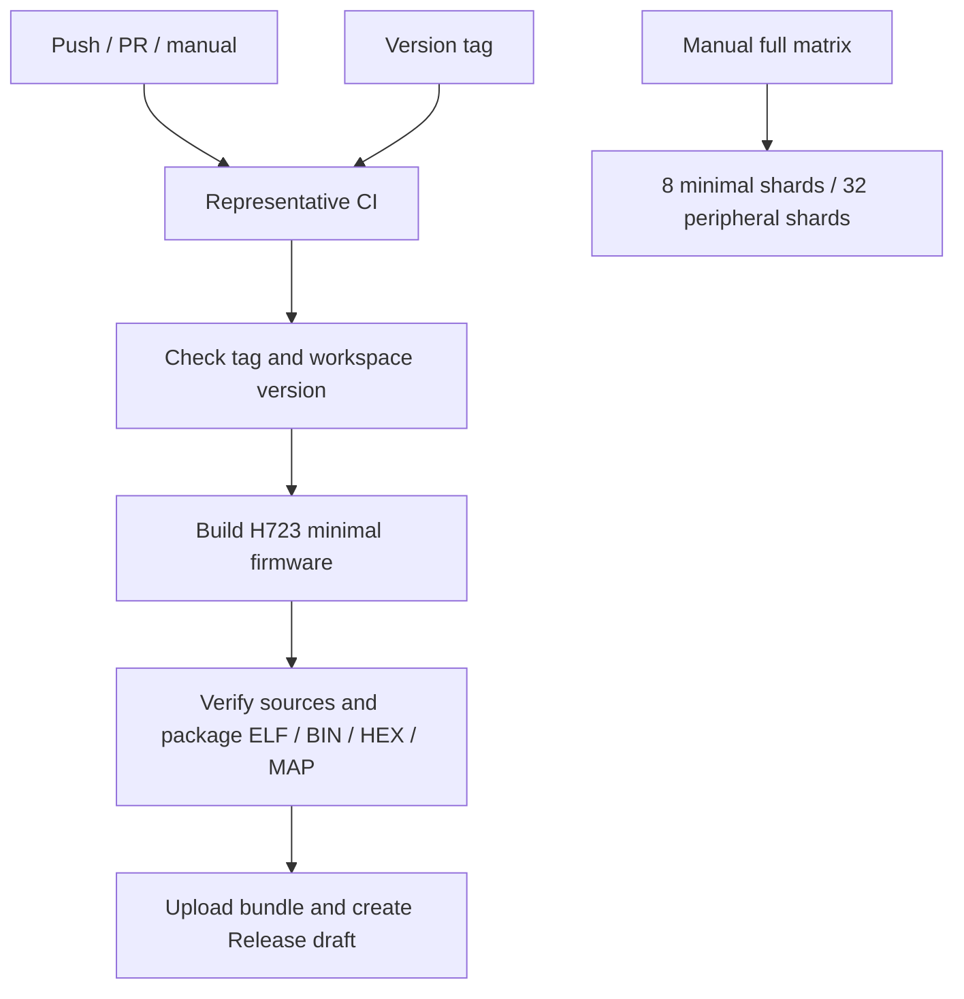

# 7. CI/CD 设计

[CI/CD 设计](ci-cd.md) · [目录 / Contents](README.md) · [English](../en/ci-cd.md)

提交代码后，GitHub Actions 可以自动执行格式检查、编译和链接。这部分称为 CI（持续集成），用于发现当前源码的构建问题。打版本标签后，发布工作流从同一提交打包固件并建立发布草稿，这里称为 CD。维护者检查附件后再发布。

本章说明仓库配置了哪些步骤。某次远端运行是否成功，要查看对应的 Actions 结果；这些工作流不连接开发板，烧录和运行验证需要另外完成。

## 什么操作会启动检查

| 工作流 | 何时运行 | 生成什么 |
|---|---|---|
| [ci.yml](../../.github/workflows/ci.yml) | 推送到 main、提交 PR、手动启动，或被其他工作流调用（workflow_call） | 代表性配置的构建检查结果 |
| [full-matrix.yml](../../.github/workflows/full-matrix.yml) | 手动启动（workflow_dispatch） | 所选范围的构建报告 |
| [release.yml](../../.github/workflows/release.yml) | 推送 `v*` 标签 | H723 固件发布草稿 |



## 日常 CI 会检查哪些内容

ci.yml 定义了 8 类作业（job）。一类作业可以针对多个系统、芯片或板卡重复运行；GitHub Actions 把这组参数称为矩阵，因此实际执行的 runner（运行环境）数量会超过 8。

| 作业名 | 执行的检查 |
|---|---|
| workflow-lint | 用 actionlint 检查工作流语法、表达式和 action 参数；安装工具时校验下载文件的 SHA |
| host | 在 Ubuntu 和 Windows 上检查格式、文档链接、workspace 和 USB 编译、Clippy；运行主机契约、异步任务和资料下载测试，以及无需硬件的示例 |
| peripheral-smoke | 先用 H723 检查最小固件和七类外设，确认 Linux 上的依赖准备、构建和 ELF 检查工具可用 |
| firmware | 为其余 25 个代表配置链接最小固件、检查 ELF，并构造七类外设 |
| reference-boards | 为五块参考板链接 release 固件，并针对 ARM 运行 Clippy |
| dual-core | 分别构建 H745BG/H747XI 的两个内核固件，检查共享内存区布局是否一致 |
| generated-project | 生成独立 G474 工程，检查格式、构建链接、运行 Clippy，并核对生成源码和锁文件是否被构建修改 |
| generated-dual-project | 生成两组独立双核工程，检查格式、成对构建、逐核运行 Clippy，并核对源码和锁文件 |

firmware 矩阵在 peripheral-smoke 和两组 generated-dual-project 都成功后才启动。公共构建工具出错时，先修复前置作业；后面的跳过状态不表示检查通过。H723 加上矩阵中的 25 个配置，仍覆盖原来的 26 个代表配置。离线辅助工程运行前，CI 会执行 cargo fetch --locked，下载完整的锁定依赖。

双核生成工程用 `cargo fmt --check -p ...` 检查两个 App 包和构建工具包；框架源码的格式由 host 作业检查。这里不用 `--all`，因为它还会递归检查本地路径依赖，要求改动 `Framework/vendor/` 中固定版本的 PAC 源码。

Clippy 是 Rust 的静态代码检查工具。主机测试还检查队列、任务取消和下载失败等行为；资料下载测试使用本地 HTTP 服务，不依赖外部镜像站。这些检查不连接开发板，不能代替实机验证。

## 提交前在本地运行什么

在仓库根目录、已激活工具链的终端运行：

```text
cargo fmt --all --check
python scripts/check_docs.py
cargo check --workspace --locked
cargo check -p embodied-stm32 --features usb --locked
cargo clippy --workspace --lib --bins --locked -- -D warnings
```

fmt 检查代码格式，check 检查代码是否能编译，Clippy 检查常见代码问题。这里的主机检查在电脑上进行。需要确认固件能为 MCU 完成链接时，再单独构建一个目标：

```text
cargo xtask build --chip stm32h723vg
```

出错时，先找失败作业（job）中的第一条实际错误，再记录步骤（step）、chip、target、bank 和工具版本。芯片选择冲突时应确认只启用了所需的芯片 feature；开启所有 feature 会把互斥配置放到一起。

生成工程校验器保存源码和锁文件的哈希，也就是根据文件内容计算的校验值。它用来确认构建没有修改刚生成的工程。用户开始编辑 App 后，内容已经改变，原来的生成哈希就不再适用。

## 需要检查更多芯片时怎样运行

完整支持范围包含 895 个型号、921 个芯片/内核配置，排除项由支持策略统一处理。手动工作流把最小固件构建分成 8 组，把外设构建分成 32 组；每组称为一个 shard，外设组最多同时运行 8 个。

下面的命令运行最小固件第 0 组和外设第 0 组。需要扩大覆盖范围时，再选择其他组或启动完整工作流：

```text
cargo xtask matrix --shard 0/8
cargo fetch --locked
python xtask/scripts/fetch_source_documents.py
cargo xtask peripherals --shard 0/32
```

每个外设配置会按准确封装构造 GPIO/UART/CAN/USB/SPI/PWM/定时器。如果报告写着 `not-present`，必须能从芯片元数据确认该外设不存在。构造和链接检查通过后，外设在板上的工作情况仍需实测。

`fail-fast: false` 让一个配置失败后，其他配置仍能继续完成；失败的构建仍返回非零状态。`if: always()` 让上传步骤在前面失败时也尝试保存记录。手动矩阵产物保留 30 天，日常 firmware 作业产物保留 14 天；没有指定保留时间的条目使用仓库设置。

## 版本标签怎样变成发布附件

[package_release.py](../../scripts/package_release.py)会检查标签是否匹配 workspace 版本、芯片是否在支持范围，以及源码是否已提交且没有未提交修改。它还要求构建报告来自同一提交，并核对 ELF、MAP 和锁文件的哈希。当前版本为 0.1.0，对应 `v0.1.0`；修改版本时也要使用相应标签。

只检查标签而不发布，可在仓库根目录的 PowerShell 中运行：

```powershell
$env:RELEASE_TAG = 'v0.1.0'
python scripts/package_release.py --check-tag
```

Git Bash / Linux Bash：

```bash
RELEASE_TAG=v0.1.0 python scripts/package_release.py --check-tag
```

打包使用固定 Rust sysroot 中的 LLVM objcopy 导出 BIN/HEX；sysroot 是该工具链的安装目录。附件中的 ELF 带调试信息，HEX 带写入地址，BIN 不带地址，MAP 列出内存分配。源提交、工具版本和 SHA256SUMS 帮助确认附件由哪份源码生成、文件是否完整。

当前只打包 `stm32h723vg` 的最小固件，其 BIN 不能通用于其他型号。检查作业默认使用只读权限 `contents: read`；只有创建发布草稿的作业使用 `contents: write`。草稿要由维护者审查附件后手动发布，工作流不连接探针。

## 构建缓存占空间时怎样处理

CI 设置 `EMBODIED_CACHE_LIMIT_MIB=1024`，受管理的构建会在下一次开始前按此阈值回收缓存；本地默认值为 2048。这是构建之间的回收阈值，单次构建仍可能超过它，也不会限制所有并行 runner 或整个仓库的总占用。

`actions/cache` 只保存参考 PDF，不保存 Rust 编译产物。缓存键包含来源清单的哈希；普通 CI 中，H723 前置作业成功后，后续型号可复用它保存的 PDF。手动全矩阵使用相同的缓存。无论缓存是否命中，下载脚本都会检查文件的 SHA-256；网络错误、临时服务故障或内容不匹配最多尝试 3 次，持续不匹配仍然失败，原哈希不会自动更新。

保留需要交付的最终产物，确认没有构建在使用缓存后，再按需删除 `target/`。详见[存储说明](../storage.md)。

---

[最佳使用示范](best-practices.md) · [目录 / Contents](README.md) · [排错与常见问题](troubleshooting.md)
