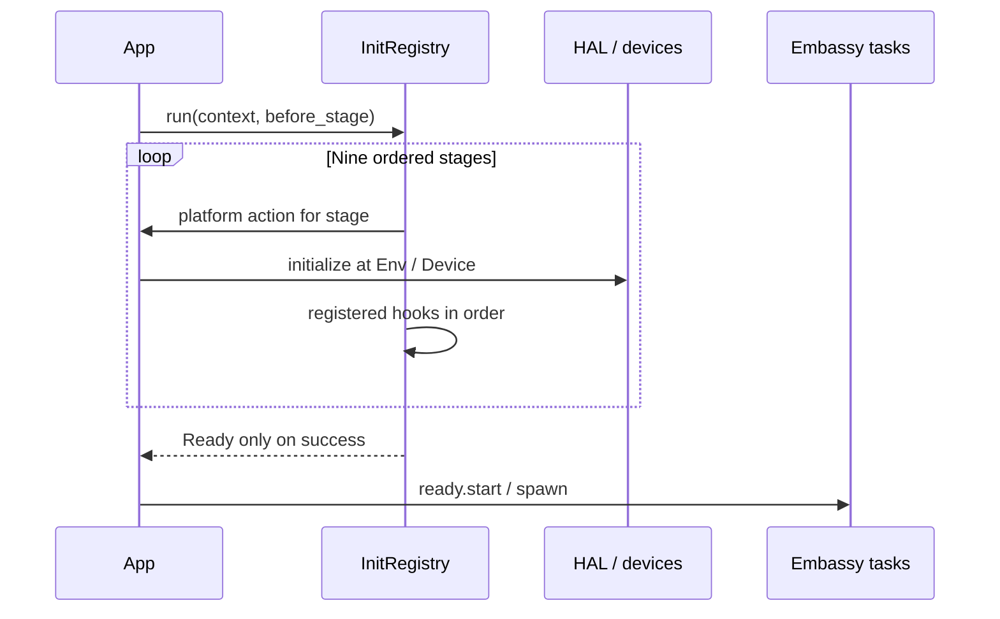

# 5. 设计原理与实现

<!-- handbook-nav -->
[手册目录](README.md) · [English](../en/design-and-implementation.md) · [项目首页](../../README.md)

写任务时，最常遇到的问题是：外设交给谁、等待时 CPU 做什么、消息满了怎么办，以及超时后资源是否还能使用。本章逐项解释这些行为，并链接到实现代码。具体外设能力仍取决于选中的 MCU。

## 把外设交给任务后，谁还能使用它

在 C 中，多个函数常通过全局 HAL handle 操作同一个外设。这里通常在初始化时取得代表外设使用权的唯一值（token），用它构造驱动，再把驱动移交给任务。Rust 称这个移交为“移动”：接收方取得所有权，原变量不能再继续使用该值。

只想临时访问一个值时，可以“借用”它。`&mut` 表示独占借用，在这段时间内只能通过这次借用修改它；`'static` 表示相应引用指向的数据可以在整个程序运行期间保持有效。这些检查帮助管理驱动和缓冲区的使用时间，实际硬件的引脚、时钟和 DMA 规则仍要满足。

| 常见 C/RTOS 写法 | 本框架中的写法 |
|---|---|
| 多处访问全局 HAL handle | 初始化取得唯一 token，构造驱动后移交给使用它的任务 |
| 用 `malloc/free` 管理消息 | 预先建立固定容量队列或池，用完后自动归还消息 |
| 获取资源后手动释放 | 获取一个 guard 或 permit 对象，由它表示资源正在被占用；对象销毁时归还资源 |
| 每线程有独立栈，等待时阻塞线程 | async 函数保存需要继续使用的状态，等待期间让执行器运行其他任务 |
| 终止线程 | 让任务协作退出，或丢弃正在等待的 Future，并按接口规则处理已开始的操作 |

这里的自动归还通过 Drop 完成。Drop 是 Rust 在值销毁时执行的清理操作，例如离开作用域或错误返回时释放 guard。后面的消息池、锁和信号量都用到了它。

## 任务等待时会发生什么

async 函数会被编译成保存执行进度的 Future。执行器检查它能否继续运行，称为 poll。如果正在等待的操作还没完成，就返回 Pending；执行器可以先运行其他任务，收到唤醒通知后再来检查。

`.await` 遇到已经完成的操作时可能立即继续，只有等待的操作返回 Pending 才会让出执行。因此，忙循环、长时间阻塞调用和耗时计算仍会拖慢同一执行器上的其他任务。框架不承诺抢占式优先级调度。Future 还要保存跨 `.await` 使用的状态，大缓冲区也会增加这部分存储需求。

## 不用堆时怎样安排 RAM

固件使用 `no_std`，也就是不依赖 Rust 的标准库和操作系统服务。核心库和运行时库禁止 unsafe 代码，用固定数组、`heapless` 容器和编译时确定的 const 容量保存资源，默认不需要堆。应用自己提供的消息或回调类型仍可能分配堆内存。

选择容量时，要把队列的 `N × 消息大小`、消息池、任务状态、USB 描述符和 DMA 缓冲都计入 RAM。小型号只组合需要的功能，并用实际 ELF 检查内存占用。feature 是 Cargo 的编译时开关；芯片 feature 互斥，聚合 crate 的默认 feature 不开启 STM32 后端。

## 初始化失败时怎样阻止业务启动

[init.rs](../../crates/embodied-core/src/init.rs) 的 `InitRegistry<C,E,N>` 保存启动时要调用的函数，这些函数称为 hook。C 是共享的初始化上下文，E 是错误类型，`N` 是最多可注册多少个 hook。即使 `N=0`，平台动作仍会经过全部九个阶段。

固定顺序为 PreCore → PostCore → PreEnv → Env → PostEnv → PreDevice → Device → PostDevice → Late。每个阶段先执行平台动作，再按注册顺序调用该阶段的 hook。第一次出错就返回错误，附带阶段名和可选的 hook 名；后续阶段停止，也不会返回 Ready。注册表一旦开始运行就不能重试。

Ready 是全部初始化完成后才得到的凭证。`Ready::start` 消费这个 token，并执行一次传入的闭包，也就是调用方提供的一段代码。把业务任务的启动集中放进这个闭包，初始化失败时就不会启动它们；直接调用原始 spawner 仍可绕过这条路径。

hook 是同步函数，不能直接等待异步初始化。如果设备启动还需要一次异步握手，App 必须完成握手后再开放依赖它的业务。

## 周期任务迟到了，下一次何时执行

[time.rs](../../crates/embodied-core/src/time.rs) 用 `u64` 微秒保存 `Instant`（时刻）和 `Duration`（时长），并检查时间运算是否溢出。`Periodic` 保存下一次应执行的绝对时刻 deadline，以及周期 period。

例如从 0 ms 开始、每 10 ms 执行一次，任务第一次得到运行机会时已经是 35 ms。此时只返回一个 tick，内容为 scheduled=10 ms、observed=35 ms、missed=2；20 ms 和 30 ms 这两次已跳过，下次 deadline=40 ms。它不会连续补跑三次，也不会把下次时间推迟到 45 ms。App 需要决定如何处理缺失的采样。

[Embassy 适配](../../crates/embodied-runtime/src/embassy.rs) 的 `next_tick` 等待绝对时刻，到时再检查周期状态。时钟换算用 `u128` 做中间计算，deadline 向上取整，观测时刻向下取整。零周期会报错；不能表示的时间也要处理：可先用 try_deadline 检查 deadline，而 EmbassyClock 的等待路径遇到超出范围的 deadline 会 panic。`from_millis/from_secs` 换算超出范围同样会 panic，所以外部输入的时间应先校验。

## 两个任务怎样交换消息

例如，一个任务收到数据后，把消息放入队列，另一个任务再取出处理。[queue.rs](../../crates/embodied-runtime/src/queue.rs) 的 `Queue<T,N>` 最多保存 N 个 T 类型的值，内部是固定容量双端队列。多个任务共享时使用 `SharedQueue`；它用短临界区保护队列状态，避免修改过程被同时访问。

`try_send/try_receive` 立即返回，不等待空间或数据。`send/receive` 暂时无法完成时，会登记 waker 并返回 Pending。waker 保存的是唤醒任务所需的信息；有了空间或消息后，执行器可以再次运行等待者。SharedQueue 的具体行为如下：

| 发生的情况 | 结果 |
|---|---|
| `try_send` 时队列已满 | 返回未发送的 T，旧消息保留 |
| `send_timeout` 超时 | 返回 `SendError<T>`，其中带着未发送的值 |
| timeout 与所需资源同时就绪 | 优先报告 timeout |
| 丢弃仍在等待的 send | 未发送值执行一次 Drop |
| 丢弃仍在等待的 receive | 不从队列取走消息 |
| `peek` | 克隆当前队首值；其他接收者随后仍可能取走原值 |
| `clear` | 一次取出所有内容，结束队列借用后执行 Drop，并唤醒发送者 |

超时参数是 `Future<Output=()>`，表示一个完成时不返回数据的等待操作，例如 Embassy Timer；这里不能直接传毫秒数。每组等待者最多有 8 个未完成操作，发送和接收分别计数。超限返回 `TooManyWaiters`。等待者不保证按先来后到的顺序获准继续。

中断中只使用不等待的接口。平台临界区实现和 waker 必须支持在中断服务函数（ISR）中调用；消息克隆和回调也必须在有限时间内完成。

## 消息用完后怎样回到池中

频繁收发相同大小的消息时，可以先准备一组消息对象，使用时取出，用完后归还。[pool.rs](../../crates/embodied-runtime/src/pool.rs) 用 `[Option<T>;N]` 保存它们：Some(T) 表示槽位里有消息，None 表示空槽。

获取消息会从一个 `Some(T)` 槽取走值，并返回 `MessageLease`。lease 表示这条消息由当前使用者持有；它不能 Clone，不能复制出另一份独立的持有权。Deref/DerefMut 让使用者能够读写里面的消息。lease 执行 Drop 时把消息放回空槽，并唤醒等待者。因此，正常离开作用域、错误返回和持有它的 Future 被取消，都使用同一个归还过程。

lease 保存消息值和池引用，没有手动重复释放接口。传给 `from_slots` 的 `None` 只增加空槽，不会生成可用消息。如果主动 `forget` lease，就会跳过 Drop，池的可用容量也会丢失。

## 怎样让任务轮流使用共享资源

需要一次只允许一个任务使用某个资源时，可以用 [AsyncMutex](../../crates/embodied-runtime/src/mutex.rs)。它内部保存 `Option<T>`；成功上锁后，T 被取出并放入 guard。其他任务要等 guard 执行 Drop、把 T 放回后才能获得它。

临界区只保护取出和归还这两步，不会跨 `.await` 保持。但锁会一直持有到 guard 被销毁。如果持锁期间又等待一个同样需要这把锁的操作，就可能死锁。应缩短 guard 持有时间；这个锁不支持递归获取，也不承诺优先级继承或按等待顺序分配。

如果允许同时使用的资源有 N 份，可以用 [CountingSemaphore](../../crates/embodied-runtime/src/semaphore.rs)。它一开始提供 N 个许可，获取后返回 Permit，Drop 时归还。它用于限制同时使用资源的数量，不能直接照搬 FreeRTOS 事件计数器任意 `give/take` 的用法。等待超时或取消时，会清理对应的等待登记。

## 收到消息时怎样通知其他代码

[Signal](../../crates/embodied-core/src/signal.rs) 让调用方登记回调，然后按登记顺序同步调用。回调类型是 `FnMut`，可以修改自己的状态；订阅可以只执行一次，也可以执行指定的 N 次。Signal 没有后台任务，回调中不能 `.await`。耗时工作可以先放入消息队列，由其他任务处理。

传入的回调引用会一直借用到 Signal 的生命周期结束。即使 unsubscribe 已停止调用某个回调，Rust 的类型检查也不会因此提前结束这段借用。

判断设备是否离线时，[ConnectionGuard](../../crates/embodied-core/src/connection.rs) 记录最后一次有效报文的时间。从未收到有效数据、已经到达 timeout 边界，或当前时间比记录时间更早，都判为离线。它不检查 CRC，因此只有协议解析成功后才能更新这条时间记录。

## 定时器停止后，旧事件还会不会执行

[TimerScheduler](../../crates/embodied-runtime/src/timer.rs) 把软件定时器保存在固定槽位中，由一个分发任务等待最近到期的定时器。每次开始、停止或修改周期都会更新 generation，它相当于该定时器当前设置的版本号。`dispatch` 先核对版本，旧版本的事件会被拒绝。

回调在临界区外执行。stop 能拦下尚未被 dispatch 确认执行的旧事件；一旦事件已经确认，即使回调尚未开始，也不能靠 stop 撤回。周期定时器会跳过错过的周期。

TimerId 同时记录编号和所属调度器，避免不同调度器中的相同编号被混用。注册数量有上限；ID 对应的槽位会一直占用到调度器销毁。使用时应由一个集中分发者等待并执行事件。

需要专用硬件比较中断时，可以用 [HardwareAlarm](../../crates/embodied-runtime/src/hardware_timer.rs)。它独占借用一个 `HardwareTimerChannel`，第一次 poll 才 arm，也就是设置并启用定时比较。完成、失败或仍在等待的 Future 被丢弃时，都会取消已经尝试的 arm。[STM32 实现](../../crates/embodied-stm32/src/hardware_timer.rs)会撤销 compare、清标志、移除 waker，并拒绝旧 IRQ；这个通道不能与执行器时间基准共用。

普通 Embassy 时间等待在取消后可能还会收到旧唤醒。软件调度器会重新检查 deadline 和 generation，避免交付旧事件；专用硬件通道则直接撤销 compare。选择定时器时，要按需要区分这两种取消行为。

## 通信超时后，已经发出的数据怎么办

[core 通信接口](../../crates/embodied-core/src/communication.rs)定义 CAN 收发操作及错误，STM32 适配器把已配置的 HAL 对象接到这些接口。UART/USB 提供异步字节流；SPI/CS/PWM 则通过 embedded-hal 接到设备接口。App 先配置实际外设，再构造 adapter，也就是接口之间的适配对象。

[CanTxService](../../crates/embodied-runtime/src/can.rs) 默认保存 12 个等待帧，另有一个槽保存当前正在尝试发送的 in-flight 帧。等待队列满时丢弃最旧的等待帧并计数，in-flight 帧保留。这与 SharedQueue 的 try_send 在队列满时把新消息退给调用者的处理方式不同。

同一个服务只允许一个发送 worker，也就是负责取帧并调用驱动的发送任务。取消或驱动错误后，in-flight 帧仍保留，下次启动 worker 可以重试；决定放弃时要使用对应的 discard 接口。`sent` 只统计驱动已接受的帧，总线 ACK 和电机是否执行需要另外观察。

UART/USB 操作取消时，部分字节可能已经传输。App 要按协议重新寻找帧边界或执行恢复，不能假定数据全部撤回。SPI 的 CS 守卫会在取消时尝试恢复高电平，但 Drop 无法向调用者返回 GPIO 错误。处理超时时，应按所用接口的这些行为安排后续操作。

## 设备读数怎样交给算法

设备模块按协议处理长度、字节序、CRC、数值范围和在线状态，算法接收数值输入。二者都不拥有板级引脚。App 决定单位、采样周期、异常后的恢复办法，以及最终控制输出。模块入口见[算法](../algorithms.md)与[设备](../devices.md)。

---

[架构设计](architecture.md) · [目录 / Contents](README.md) · [最佳使用示范](best-practices.md)
